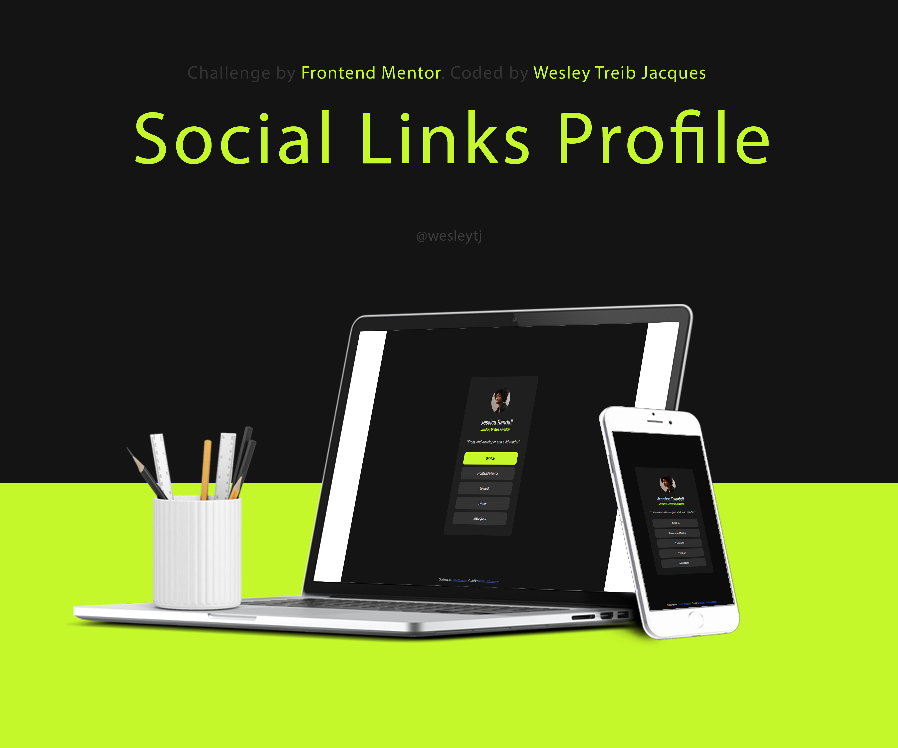

# Frontend Mentor - Social links profile solution

This is a solution to the [Social links profile challenge on Frontend Mentor](https://www.frontendmentor.io/challenges/social-links-profile-UG32l9m6dQ). Frontend Mentor challenges help you improve your coding skills by building realistic projects. 

## Table of contents

- [Overview](#overview)
  - [The challenge](#the-challenge)
  - [Screenshot](#screenshot)
  - [Links](#links)
- [My process](#my-process)
  - [Built with](#built-with)
  - [What I learned](#what-i-learned)
  - [Continued development](#continued-development)
- [Author](#author)

**Note: Delete this note and update the table of contents based on what sections you keep.**

## Overview

### The challenge

Users should be able to:

- See hover and focus states for all interactive elements on the page

### Screenshot



### Links

- Solution URL: [GitHub](https://github.com/wesleytj/social-links-profile)
- Live Site URL: [Add live site URL here]

## My process

### Built with

- Semantic HTML5 markup
- CSS custom properties
- Flexbox

### What I learned

In this project, I chose to divide it into five parts.

I made a session to maintain a maximum width of 1440px and a dark background.

```html
<body>
    <section></section>
</body>
```

```css
section{
        max-width: 1440px;
        height: 100vh;
        background-color: hsl(0, 0%, 8%);
}
```

A div that is the card that contains the profile information. 
And then, I divided it into three divs, one for the avatar, one for the description and one for the links.

```html
<section>
      <div class="card">
        <div class="img__profile"></div><!--img__profile-->
        <div class="description">
          <h2>Jessica Randall</h2>
          <h4 class>London, United Kingdom</h4>

          <p>"Front-end developer and avid reader."</p>
        </div><!--description-->

        <div class="links__profile">
          <p>GitHub</p>
          <p>Frontend Mentor</p>
          <p>LinkedIn</p>
          <p>Twitter</p>
          <p>Instagram</p>
        </div><!--links__profile-->
      </div><!--card-->
</section>
```


### Continued development

For my continued development, I seek to improve my item alignment skills by seeking to improve and refine good practices.**

## Author

- Website - [Wesley Treib Jacques]([Vercel](https://vercel.com/wesley-treib-jacques-projects))
- Frontend Mentor - [@wesleytj]([Frontend Mentor | Wesley Jacques's profile](https://www.frontendmentor.io/profile/wesleytj))
- LinkedIn- [@wesley-jacques]([Wesley Treib Jacques | LinkedIn](https://www.linkedin.com/in/wesley-jacques/))
